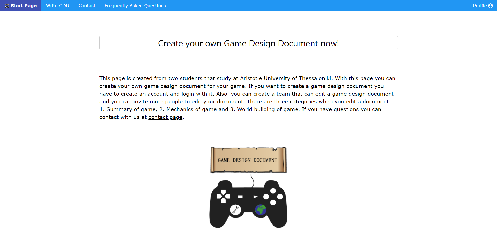

  

<h3 align="center">Game Design Document Maker</h3>

## About the project

This page is created from two students that study at Aristotle University of Thessaloniki. With this page you can create your own game design document for your game. 
If you want to create a game design document you have to create an account and login with it. Also, you can create a team that can edit a game design document and you can 
invite more people to edit your document. There are three categories when you edit a document: 1. Summary of game, 2. Mechanics of game and 3. World building of game.

### Built With
* HTML
* CSS
* JavaScript
* PHP